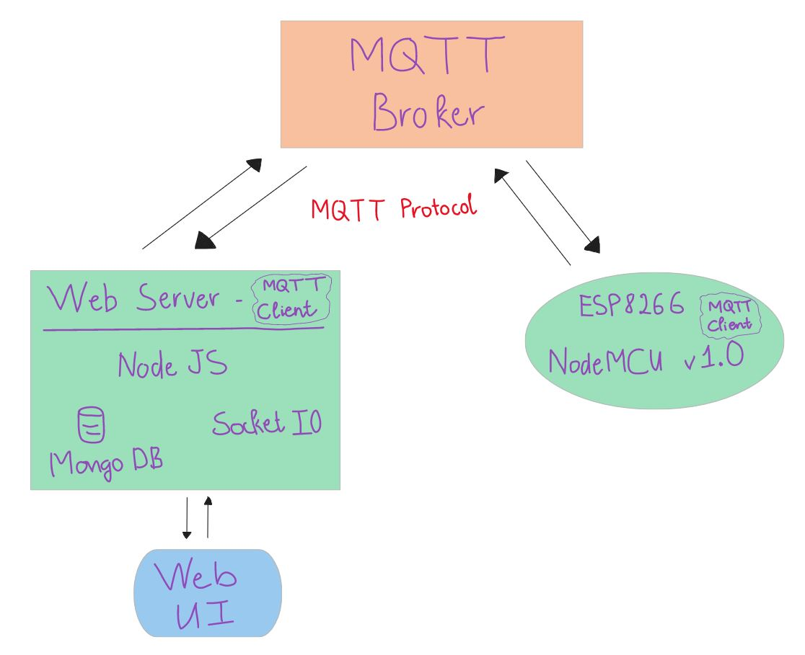
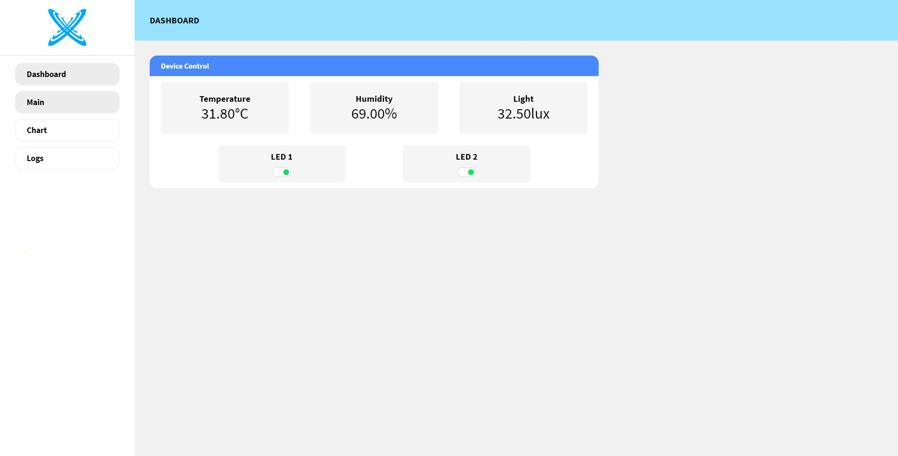
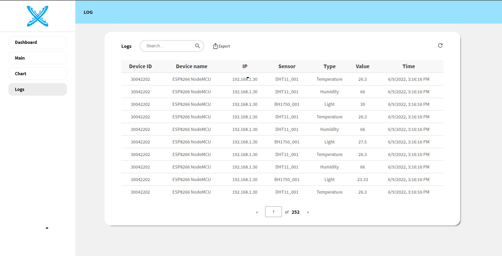
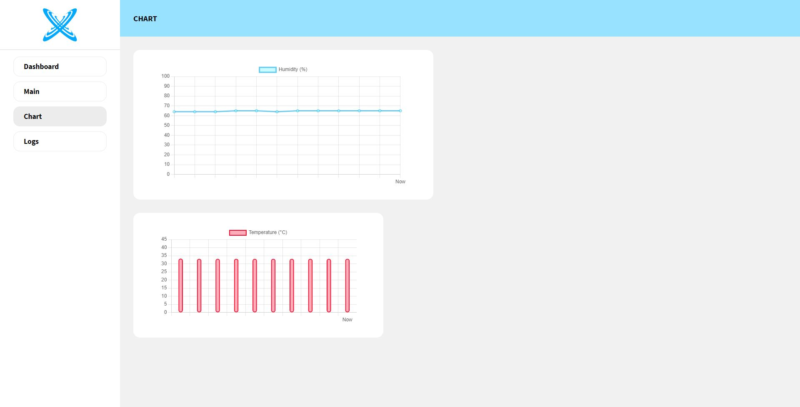

# Internet of Things PROJECT

### Languages and Tools:

 

 
 

---

## Architectures

 

 
 
 

- MQTT Broker: https://www.shiftr.io/
- MQTT Client: MQTT.js
- Devices:
  - 2 Led
  - DHT11: Temperature and Humidity sensor
  - BH1750: Light sensor

 

---

## Demo

 

 
 

 
 

